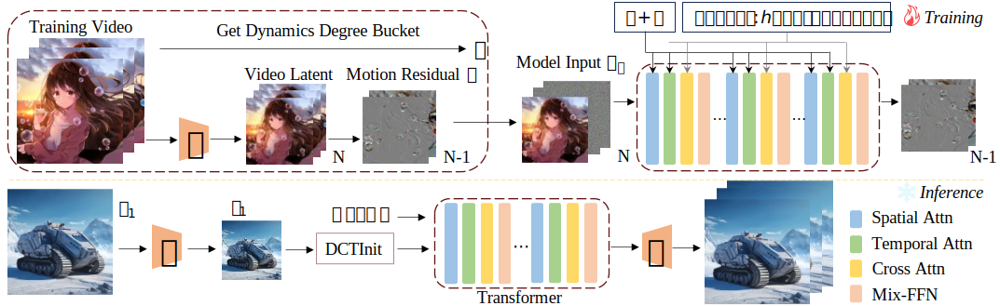

## Consistent and Controllable Image Animation with Motion Linear Diffusion Transformers<br><sub>Official PyTorch Implementation</sub>

[](https://arxiv.org/abs/2401.03048)
[](https://maxin-cn.github.io/miramo_project/)
[](https://huggingface.co/spaces/maxin-cn/Latte-1)

> [**Consistent and Controllable Image Animation with Motion Linear Diffusion Transformers**](https://maxin-cn.github.io/cinemo_project/)<br>
> [Xin Ma](https://maxin-cn.github.io/), [Yaohui Wang*](https://wyhsirius.github.io/), [Gengyun Jia](https://scholar.google.com/citations?user=_04pkGgAAAAJ&hl=zh-CN), [Xinyuan Chen](https://scholar.google.com/citations?user=3fWSC8YAAAAJ), [Tien-Tsin Wong](https://ttwong12.github.io/myself.html), [Cunjian Chen*](https://cunjian.github.io/) <br>
> (*Corresponding authors)

This repo contains pre-trained weights, and sampling code of MiraMo. Please visit our [project page](https://maxin-cn.github.io/miramo_project/) for more results.

<div align="center">
    
</div>

## News

- 🔥 **Jul. 31, 2025** 💥 The inference code is released. The pre-trained models will come soon. Stay tuned!

## Setup

Download and set up the repo:

```bash
git clone https://github.com/maxin-cn/MiraMo
cd MiraMo
conda env create -f environment.yml
conda activate miramo
```

## Usage
Launching soon. Please stay tuned!

## Open-source plan

- [x] T2V Inference 
- [ ] T2V Checkpoints
- [ ] I2V Inference 
- [ ] I2V Checkpoints
- [ ] Training

## Citation
If you find this work useful for your research, please consider citing it.
Launching soon. Please stay tuned!

## Acknowledgments
MiraMo has been greatly inspired by the following amazing works and teams: [Latte](https://github.com/Vchitect/Latte) and [SANA](https://github.com/NVlabs/Sana). We thank all the contributors for open-sourcing.

## License
The code and model weights are licensed under [LICENSE](LICENSE).